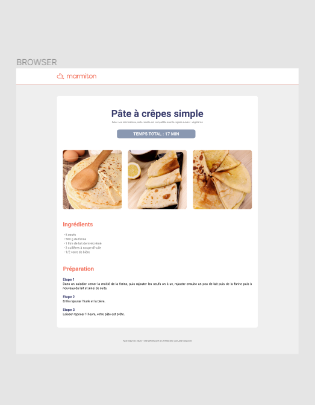

# Marmiton

## **Réalisation d'une maquette de recette de cuisine**

 Exercice réalisé dans le cadre du [Bootcamp "Le Reacteur"](https://www.lereacteur.io/) 

**Objectifs** :

- Manipuler du HTML/CSS.
- Être capable de réaliser des missions d'intégrations.
- Création d'une page simplifiée d'une recette du site internet [Marmiton](https://www.marmiton.org/).
- Respecter la maquette initiale fournie via l'outil [Figma](https://www.figma.com/fr/).

**Fonctionnalités souhaitées:**
La maquette devra respecter un cahier des charges (police, structure HTML, taille d'images etc...).

Vous pouvez retrouver la [maquette proposée](https://www.figma.com/file/5FH3NgzJWAsONNPIEQT1vJ/marmiton?node-id=0%3A1)

